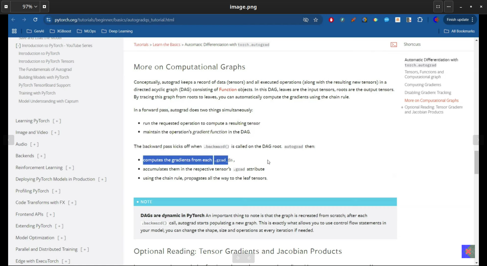

### **DAGs**
---
a directed acyclic graph (DAG) is a finite directed graph with no directed cycles. In the context of PyTorch's autograd, the computational graph is a DAG where nodes represent tensors and edges represent operations.

---



---
In PyTorch, **autograd** and **`requires_grad`** are core concepts for automatic differentiation, which is essential for training neural networks.

---

### **1. Autograd in PyTorch**

- **Autograd** is PyTorch's automatic differentiation engine.
- It tracks operations on tensors and computes gradients automatically.
- When you perform operations on tensors with `requires_grad=True`, PyTorch builds a **computational graph** in the background.
- This graph is used to compute gradients via **backpropagation** when you call `.backward()`.

---

### **2. `requires_grad`**

- **`requires_grad`** is a boolean attribute of a PyTorch tensor.
- If `requires_grad=True`, PyTorch tracks all operations on that tensor for gradient computation.
- If `requires_grad=False`, the tensor is excluded from the computational graph, and no gradients are computed for it.

### **Example:**

```python
import torch

# Tensor with gradient tracking
x = torch.tensor([1.0, 2.0], requires_grad=True)

# Perform an operation
y = x * 2

# Compute gradients
y.sum().backward()# Sum to get a scalar for backward()# Access gradients
print(x.grad)# Output: tensor([2., 2.])

```

---

### **Key Points**

- **`requires_grad=True`**: Enables gradient tracking for that tensor.
- **`requires_grad=False`**: Disables gradient tracking (default for most tensors).
- **`with torch.no_grad():`**: Temporarily disables gradient tracking for a block of code.

### **Example of `no_grad`:**

```python
with torch.no_grad():
    y = x * 2# No gradients tracked here

```

---

### **When to Use**

- Use `requires_grad=True` for model parameters (e.g., weights and biases).
- Use `requires_grad=False` for input data or intermediate tensors where gradients are unnecessary.

---