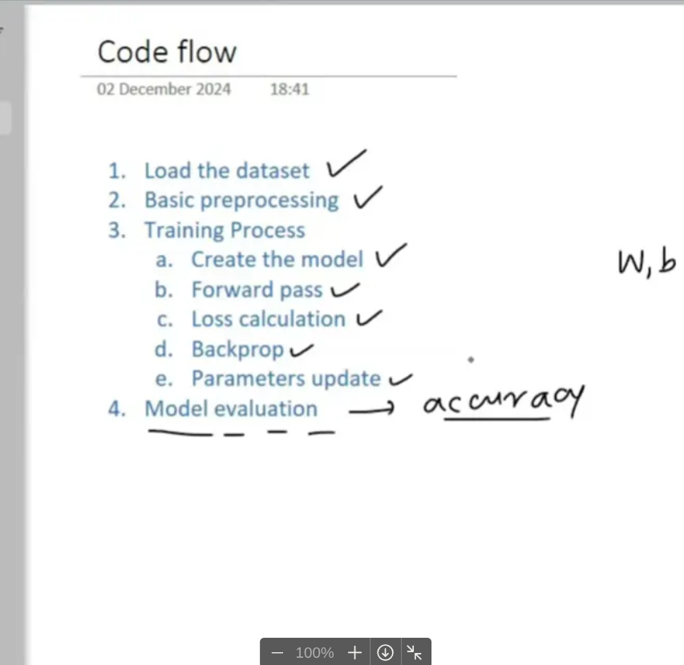

## plan of attack

- [x]  we’ll build a simple nn
- [x]  train it on a real world dataset
- [x]  we’ll mimic the pytorch workflow and have a lot of manual elements
- [x]  and yes, our end goal isn’t about improving accuracy but to understand the foundation (training pipeline_)

---

---

## **1. Model Creation**

**What it does**: Initializes the model with random weights and biases.
**When to use**: At the start of training.

```python
model = MySimpleNN(X_train_tensor)# Initialize model

```

---

## **2. Training Loop**

**What it does**: Iterates over the dataset for a fixed number of epochs.
**When to use**: Always, to train the model.

```python
for epoch in range(epochs):
# Training logic here

```

---

## **3. Forward Pass**

**What it does**: Computes predictions using the current model parameters.
**When to use**: At the start of every iteration.

```python
y_pred = model.forward(X_train_tensor)# Forward pass

```

---

## **4. Loss Calculation**

**What it does**: Measures how wrong the predictions are.
**When to use**: After the forward pass, to guide optimization.

```python
loss = model.loss_function(y_pred, y_train_tensor)# Compute loss

```

---

## **5. Backward Pass**

**What it does**: Computes gradients of the loss w.r.t. model parameters.
**When to use**: After loss calculation, to determine how to update parameters.

```python
loss.backward()# Backpropagate gradients

```

---

## **6. Parameter Update**

**What it does**: Adjusts weights and biases to reduce the loss.
**When to use**: After the backward pass, to improve the model.

```python
with torch.no_grad():# Disable gradient tracking
    model.weights -= learning_rate * model.weights.grad# Update weights
    model.bias -= learning_rate * model.bias.grad# Update bias

```

---

## **7. Zero Gradients**

**What it does**: Resets gradients to zero to prevent accumulation.
**When to use**: After parameter updates, before the next iteration.

```python
model.weights.grad.zero_()# Reset gradients for weights
model.bias.grad.zero_()# Reset gradients for bias

```

---

## **8. Print Loss**

**What it does**: Monitors training progress.
**When to use**: At the end of each epoch, for debugging and tracking.

```python
print(f'Epoch: {epoch + 1}, Loss: {loss.item()}')# Print loss

```

---

## **When to Use What: Intuition**

| Step | Intuition |
| --- | --- |
| **Forward Pass** | "What does the model predict right now?" |
| **Loss Calculation** | "How wrong is the model?" |
| **Backward Pass** | "Which parameters are responsible for the error, and by how much?" |
| **Parameter Update** | "Adjust the parameters to reduce the error." |
| **Zero Gradients** | "Clear the slate for the next batch; don’t carry forward old gradients." |
| **Print Loss** | "Am I making progress? Is the loss decreasing?" |

---

## **Key Snippets**

### **Manual Training Loop**

```python
for epoch in range(epochs):
# Forward pass
    y_pred = model(X_train_tensor)
# Loss calculation
    loss = loss_function(y_pred, y_train_tensor)
# Backward pass
    loss.backward()
# Parameter update
    with torch.no_grad():
        for param in model.parameters():
            param -= learning_rate * param.grad
# Zero gradients
    model.zero_grad()
# Print loss
    print(f'Epoch: {epoch + 1}, Loss: {loss.item()}')

```

### **Using PyTorch Optimizer (Recommended)**

```python
optimizer = torch.optim.SGD(model.parameters(), lr=learning_rate)
for epoch in range(epochs):
# Forward pass
    y_pred = model(X_train_tensor)
# Loss calculation
    loss = loss_function(y_pred, y_train_tensor)
# Backward pass
    loss.backward()
# Parameter update
    optimizer.step()
# Zero gradients
    optimizer.zero_grad()
# Print loss
    print(f'Epoch: {epoch + 1}, Loss: {loss.item()}')

```

---
